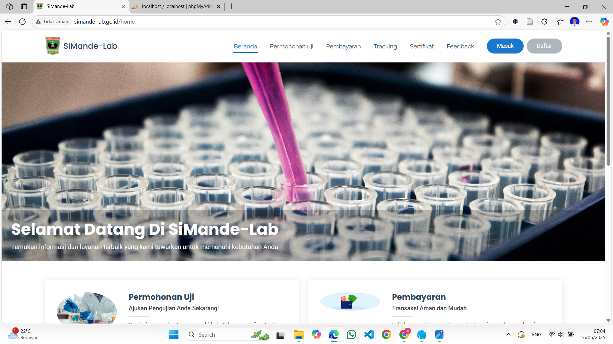
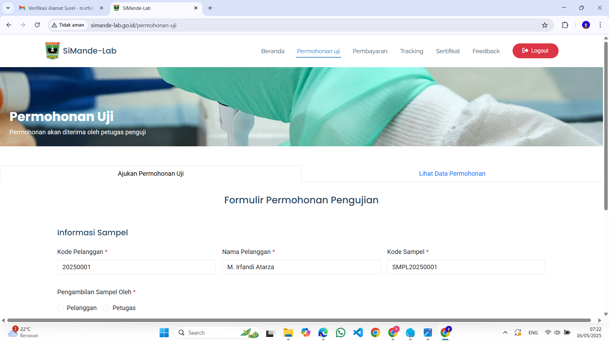
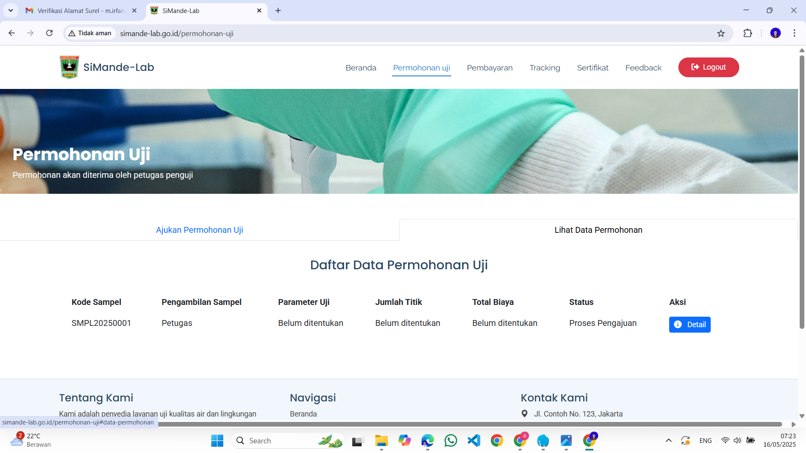
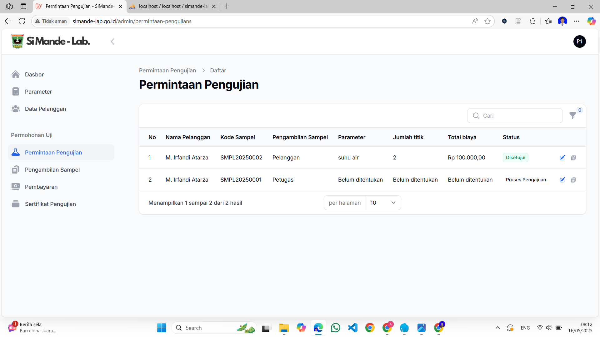
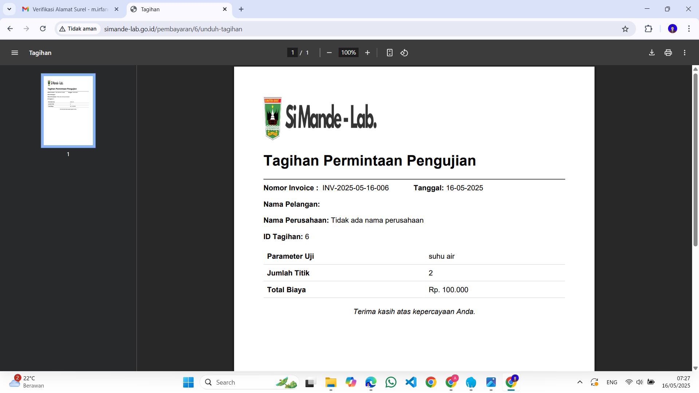
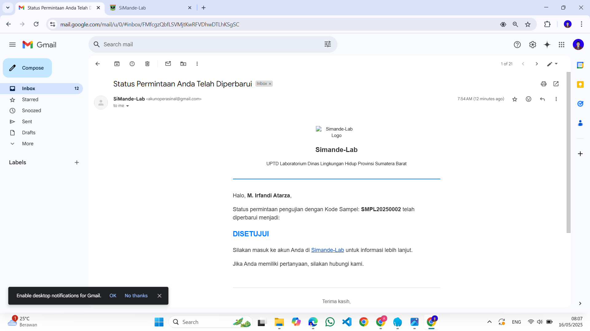

# SiMande-Lab (Sistem Manajemen Data Elektronik Laboratorium)

SiMande-Lab adalah aplikasi web yang dirancang untuk membantu pengelolaan data elektronik laboratorium. Sistem ini mendukung pengelolaan data oleh tiga jenis level akses: **Admin Dinas Lingkungan Hidup**, **Admin UPTD Laboratorium**, dan **Pelanggan/Pengguna**.

## Fitur Utama

- **Manajemen Data**: Pengelolaan data laboratorium secara efisien.
- **Role-Based Access Control**: Hak akses sesuai dengan level pengguna.
  - **Admin Dinas Lingkungan Hidup**: Memiliki kontrol penuh terhadap data dan pengelolaan pengguna.
  - **Admin UPTD Laboratorium**: Mengelola data laboratorium dan laporan.
  - **Pelanggan/Pengguna**: Mengakses informasi hasil uji dan melakukan pengajuan terkait layanan laboratorium.
- **Antarmuka Modern**: Dibangun dengan Laravel Filament untuk pengalaman pengguna yang intuitif.

## Teknologi yang Digunakan

- **Framework**: Laravel 11
- **UI Library**: Laravel Filament (Versi 3)
- **Database**: MySQL atau PostgreSQL (sesuai konfigurasi)
- **Front-End**: Blade Templates dengan Filament Components
- **Dependency Management**: Composer dan NPM

## Screenshots Sistem

### Halaman Pelanggan

    
    
    

### Halaman Dashboard Admin

    

### Halaman Petugas

    

### Tagihan 

    

### Perbaruan Status Email

    


## Instalasi

1. Clone repositori ini:

   ```bash
   git clone https://github.com/username/SiMande-Lab.git
   cd SiMande-Lab
   ```

2. Instal dependensi menggunakan Composer dan NPM:

   ```bash
   composer install
   npm install
   npm run dev
   ```

3. Konfigurasikan file `.env`:

   ```bash
   cp .env.example .env
   ```
   Atur database dan konfigurasi lainnya di file `.env`.

4. Jalankan migrasi dan seeder:

   ```bash
   php artisan migrate --seed
   ```

5. Jalankan server pengembangan:

   ```bash
   php artisan serve
   ```

6. Akses aplikasi di [http://localhost:8000](http://localhost:8000).

## Struktur Level Akses

### Admin Dinas Lingkungan Hidup
- Mengelola seluruh data pengguna.
- Mengontrol data laboratorium.
- Membuat dan memverifikasi laporan resmi.

### Admin UPTD Laboratorium
- Mengelola data laboratorium.
- Mengelola laporan dan hasil uji.

### Pelanggan/Pengguna
- Mengajukan layanan laboratorium.
- Melihat hasil uji dan laporan terkait.

## Kontribusi

Kontribusi sangat diterima! Silakan fork repositori ini dan kirimkan pull request untuk perubahan besar atau kecil. Pastikan untuk mendiskusikan perubahan terlebih dahulu melalui isu di GitHub.

## Lisensi

Proyek ini dilisensikan di bawah [MIT License](LICENSE).

---

Dibangun dengan ❤️ menggunakan Laravel 11 dan Filament V3.
